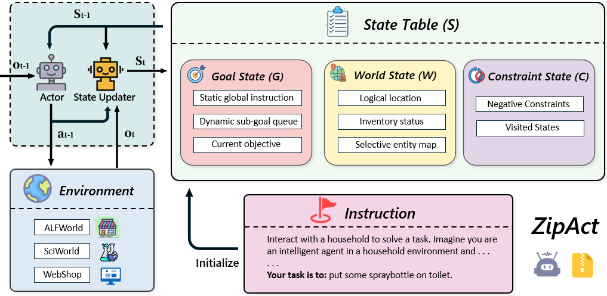
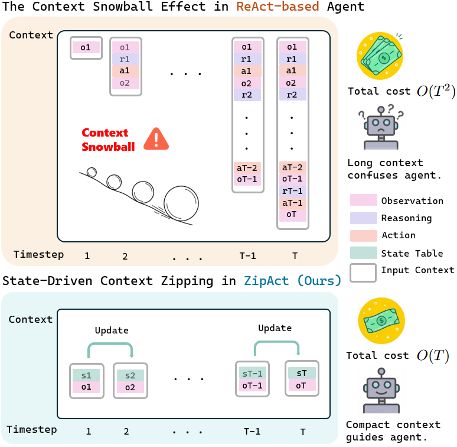

# ZipAct: Zipping Interaction History into a Compact State

<div align="center">

[](https://arxiv.org/)
[](https://www.python.org/downloads/)
[](https://opensource.org/licenses/MIT)

**Efficient LLM Agents via State-Dependent Reasoning**

[Paper](https://arxiv.org/) | [Demo](#-usage) | [Documentation](#-documentation)

</div>

---

## 🎯 Overview

**ZipAct** addresses the "Context Snowball" problem in LLM agents by shifting from **history-dependent** to **state-dependent** reasoning.

<div align="center">

</div>

### Key Idea

Instead of accumulating raw interaction history, ZipAct maintains a compact structured state:

$$S_t = \langle G_t, W_t, C_t \rangle$$

- **Goal State ($G_t$)**: Tracks hierarchical task progress
- **World State ($W_t$)**: Abstracts environment into task-relevant variables  
- **Constraint State ($C_t$)**: Anti-loop mechanism for avoiding failures

### The Context Snowball Problem

<div align="center">

</div>

**ReAct-based agents** suffer from quadratic complexity $O(T^2)$ as context grows unboundedly. **ZipAct** achieves linear complexity $O(T)$ through state compression, reducing token usage by **~70%** while maintaining performance.


## � Results

### Performance Comparison on ALFWorld

| Model | Agent | Success Rate | Avg Tokens/Episode | Token Reduction |
|-------|-------|--------------|-------------------|-----------------|
| GPT-4o | ReAct | 85.1% | 10,500 | baseline |
| GPT-4o | **ZipAct** | **85.0%** | **3,000** | **-71%** ✅ |
| GPT-4o | Reflexion | 93.3% | 23,000 | +120% ❌ |
| GPT-4o-mini | ReAct | 53.0% | 8,200 | baseline |
| GPT-4o-mini | **ZipAct** | **53.0%** | **2,500** | **-68%** ✅ |
| GPT-4o-mini | Reflexion | 66.4% | 18,000 | +120% ❌ |

**Key Insight**: ZipAct maintains competitive success rates while dramatically reducing token consumption, making it ideal for cost-sensitive deployments.

## 🚀 Quick Start

### Installation

```bash
git clone https://github.com/your-username/ZipAct.git
cd ZipAct
pip install -r requirements.txt
```

### Setup

```bash
# Set your OpenAI API key
export OPENAI_API_KEY="your-api-key-here"

# (Optional) For Qwen or other compatible APIs
export OPENAI_BASE_URL="https://your-api-endpoint"

# Install ALFWorld
pip install alfworld
```

### Run Your First Experiment

```bash
# Run ZipAct on ALFWorld
python run_alfworld.py --agent zipact --model gpt-4o-mini --episodes 5

# Run ReAct baseline for comparison
python run_alfworld.py --agent react --model gpt-4o-mini --episodes 5

# See detailed execution with verbose mode
python run_alfworld.py --agent zipact --episodes 1 --verbose
```

## 💡 Usage

### Available Agents

- **`zipact`**: Our method (state-dependent reasoning)
- **`react`**: ReAct baseline (history-dependent)
- **`reflexion`**: Reflexion (ReAct + self-reflection)
- **`obs_mask`**: Observation masking baseline
- **`summary`**: History summarization baseline

### Run Experiments

```bash
# Single experiment
python run_alfworld.py \
    --agent zipact \
    --model gpt-4o-mini \
    --episodes 10 \
    --max_steps 50

# Batch experiments (all agents)
./run_batch.ps1 -Episodes 20

# Multi-dataset support
python run_experiment.py \
    --dataset alfworld \
    --agent zipact \
    --episodes 10
```

### Analyze Results

```bash
# Generate comparison tables and statistics
python analyze_results.py --log_dir logs
```

Results are saved in `logs/` as:
- `{experiment_name}.jsonl` - Detailed episode logs
- `{experiment_name}_summary.json` - Statistics summary

## 🏗️ Architecture

### State Structure

```json
{
  "goal_state": {
    "global_instruction": "put a clean apple in refrigerator",
    "sub_goal_queue": ["clean the apple", "find refrigerator"],
    "current_objective": "find an apple"
  },
  "world_state": {
    "location": "kitchen",
    "inventory": ["apple_1"],
    "entity_map": {"countertop_1": "visited", "apple_1": "dirty"},
    "discovered_objects": ["apple_1", "sink_1", "fridge_1"]
  },
  "constraint_state": {
    "negative_constraints": ["drawer_1 is locked"],
    "visited_locations": ["kitchen", "living room"],
    "attempted_actions": ["open drawer_1"]
  }
}
```

### Core Components

- **Actor (π)**: Memory-less decision engine that acts based on current state
- **State Updater (U)**: Semantic compressor that zips history into structured state
  - Goal Progression Analysis
  - World Patching
  - Failure Reflection

## 📂 Project Structure

```
ZipAct/
├── src/
│   ├── agents/          # Agent implementations
│   │   ├── zipact.py   # ZipAct (our method)
│   │   ├── react.py    # ReAct baseline
│   │   └── ...
│   ├── envs/           # Environment wrappers
│   ├── llm/            # LLM client with token tracking
│   └── utils/          # Logging and evaluation
├── run_alfworld.py     # Main evaluation script
├── run_experiment.py   # Multi-dataset runner
└── analyze_results.py  # Results analysis
```

## 🔬 Supported Datasets

| Dataset | Status | Description |
|---------|--------|-------------|
| **ALFWorld** | ✅ Fully Supported | Household tasks (cleaning, heating, etc.) |
| **SciWorld** | 🚧 Interface Ready | Scientific reasoning tasks |
| **WebShop** | 🚧 Interface Ready | E-commerce navigation |

## 📖 Documentation

- **[Quick Start](QUICKSTART.md)** - Detailed setup and usage guide
- **[Project Structure](STRUCTURE.md)** - Code organization and architecture
- **[API Documentation](src/)** - Inline code documentation

## 🤝 Contributing

We welcome contributions! Please feel free to submit issues or pull requests.

## � Citation

If you find this code useful, please cite our paper:

```bibtex
@article{pan2025zipact,
  title={ZipAct: Zipping Interaction History into a Compact State for Efficient LLM Agents},
  author={Pan, Zhiming and Luo, Xiao},
  journal={arXiv preprint arXiv:2501.xxxxx},
  year={2025}
}
```

## � License

This project is licensed under the MIT License - see the [LICENSE](LICENSE) file for details.

## 🙏 Acknowledgments

- [ALFWorld](https://github.com/alfworld/alfworld) - Environment framework
- [ReAct](https://arxiv.org/abs/2210.03629) - Yao et al., ICLR 2023
- [Reflexion](https://arxiv.org/abs/2303.11366) - Shinn et al., NeurIPS 2023

## � Contact

- **Zhiming Pan** - thomas_p@stu.pku.edu.cn
- **Xiao Luo** - xiao.luo@wisc.edu

For questions or issues, please open a GitHub issue.

